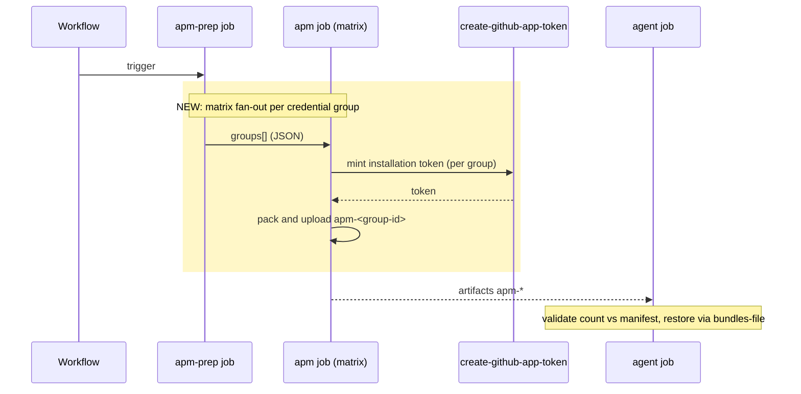
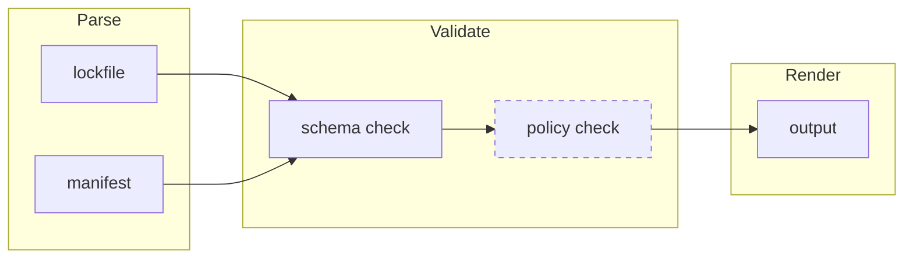
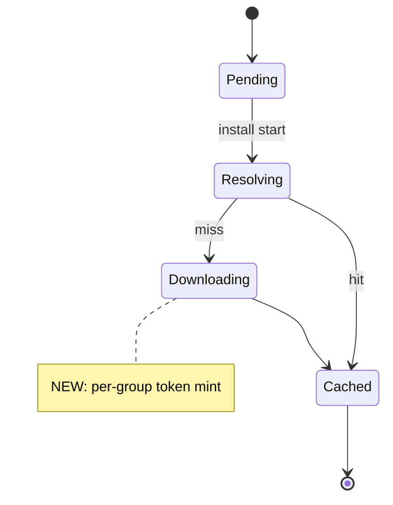

# Mermaid conventions for PR bodies

Load this asset before drafting any mermaid block in a PR body. It
defines (a) which diagram TYPE to pick per intent, (b) the boxing /
styling vocabulary that highlights NEW behavior, and (c) the
GitHub-renderer gotchas that `mmdc` does NOT always catch.

This asset is scoped to **PR bodies**. Architectural design diagrams
(component, thread fan-out, dependency graph) are owned by the
`genesis` skill and have a different convention set; do not conflate.

## Diagram type by intent

A PR body diagram answers ONE question. Pick the type that matches
the question; do not mix.

| Reviewer's question | Diagram type | Boxing convention for "what changed" |
|---|---|---|
| Which jobs / participants run, in what order? (execution flow) | `sequenceDiagram` | `rect rgb(255, 247, 200)` block around new participant interactions; `Note over X` for invariants |
| What is the data / control pipeline? (stages, transformations) | `flowchart LR` | `subgraph` per stage; `classDef new stroke-dasharray: 5 5` for new stages; class assignment via `class N1,N2 new` |
| What does the state machine look like? | `stateDiagram-v2` | `note right of S: NEW` markers on changed states |
| How do components / files relate? (architecture) | `flowchart LR` | `classDef new stroke-dasharray: 5 5`; subgraphs for layers |
| Is there a true type hierarchy? (rare) | `classDiagram` | standalone `class Name:::cssClass` lines only -- inline `:::` on relationship lines fails on GitHub |

### Default for "execution flow" PRs

If the PR adds, removes, or reorders **jobs, steps, or third-party
action invocations** in a workflow, use `sequenceDiagram`. Reviewers
read it top-to-bottom as a temporal sequence; the participant lanes
make the boundary between "workflow", "job", and "external action"
explicit. A flat `flowchart TD` of the same content forces the reader
to reconstruct the temporal axis from arrows and is harder to scan.

Use `rect rgb(...)` blocks to group the messages that the PR ADDS;
this gives the reviewer a single visual region to focus on without
hunting for `classDef`-marked nodes.

### Default for "pipeline" PRs

If the PR changes a data flow with discrete stages (parse -> validate
-> render), use `flowchart LR` with one `subgraph` per stage. Mark
NEW stages with `classDef new stroke-dasharray: 5 5;` and assign
nodes via `class N1,N2 new;`. Avoid `flowchart TD` for left-to-right
pipelines; it wastes vertical space and breaks scanning rhythm.

## Canonical templates

### sequenceDiagram (execution flow)



Conventions:

- Each `participant` is a distinct actor (workflow, job, action). Do
  NOT inline step-level work as participants -- those go inside the
  sender's lane as `X->>X: action`.
- `->>` is a synchronous send; `-->>` is a return. Pick consistently.
- Wrap NEW interactions in `rect rgb(255, 247, 200)` (a soft yellow).
  ASCII labels inside the rect are fine.
- `Note over` is for invariants ("single-writer", "must be true after
  this point"), not for narrative.

### flowchart LR (pipeline / architecture)



Conventions:

- One `subgraph` per logical stage; the subgraph label is the stage
  name (capitalize for scanability).
- Mark NEW nodes with `classDef new stroke-dasharray: 5 5;` and a
  separate `class N new;` assignment line (NOT inline `N:::new`,
  which works in flowchart but is inconsistent with classDiagram and
  hurts copy-paste portability).
- Edges carry verbs only when non-obvious. Default to unlabeled.
- Prefer `LR` for pipelines (left-to-right reads naturally). Use
  `TD` only for tree-shaped hierarchies.

### stateDiagram-v2 (state machine)



Convention: `note right of X` requires the multi-line form with
`end note` on its own line. Single-line `note right of X: text` is
NOT supported in `stateDiagram-v2` -- it parses elsewhere but
fails here.

## GitHub-renderer gotchas (drift-known, mmdc does NOT always catch)

These are renderer-level rejections that `mmdc` may parse cleanly
because mmdc and GitHub's mermaid version sometimes drift. Treat the
following as PR-body-specific rules, not as guesses.

### Square brackets in edge labels MUST be quoted

Wrong (parses on mmdc, rejected by GitHub):

```
A -->|[EXEC] do work| B
```

Right:

```
A -->|"[EXEC] do work"| B
```

GitHub's mermaid sees the inner `[` as an attempted node-label start
and raises `Expecting 'TAGEND', 'STR', ..., got 'SQS'`. Always quote
edge labels containing brackets, parentheses, colons, slashes, or
pipes.

### Inline `:::cssClass` fails in `classDiagram` on GitHub

Wrong: `LockFile *-- LockedDependency:::touched`
Right: separate `class LockedDependency:::touched` line.

This works in `flowchart` but fails in `classDiagram` on GitHub
(parser reports `Expecting 'NEWLINE', 'EOF', 'LABEL', got
'STYLE_SEPARATOR'`).

### Round brackets `()` in node labels need quoting

Wrong: `A[foo (bar)]`
Right: `A["foo (bar)"]`

### Pipes `|`, angle brackets `<>`, and double quotes inside labels

These are mermaid operators. Quote the label or HTML-escape:
`A["a &quot;b&quot; c"]`, `A["a | b"]`, `A["a &lt; b"]`.

### Semicolons in `classDiagram` link labels

Wrong: `A --> B : dispatches; verifies 3 artifacts`
Right: `A --> B : dispatches, verifies 3 artifacts` (use commas).

### Colons in flowchart edge labels

Wrong (ambiguous): `A --> B[trigger: received]`
Right: `A --> B : trigger received` (or quote: `A --> B["trigger: received"]`).

## Validation discipline (PR-body-specific)

The skill's existing `mmdc` step catches most parser errors. Add the
following on top:

1. **Dual-validate any execution-flow diagram.** Run `mmdc` AND paste
   the block into <https://mermaid.live> to see GitHub's renderer
   behavior. mmdc and GitHub drift; mermaid.live tracks GitHub more
   closely.
2. **Eyeball the rendered output before saving.** A diagram that
   parses but produces overlapping arrows or unreadable boxing is
   not done. Re-run with `LR` instead of `TD`, split into two
   diagrams, or simplify.
3. **Confirm on GitHub after the PR is opened.** If a block fails to
   render after pushing, edit immediately. Unrendered mermaid blocks
   on GitHub display as raw fenced code, which signals carelessness.

## Quick reference: when in doubt

- "Show me the order of operations" -> `sequenceDiagram`.
- "Show me the data path" -> `flowchart LR`.
- "Show me the new behavior at a glance" -> `rect rgb(...)` block in
  `sequenceDiagram`, OR `classDef new stroke-dasharray: 5 5` +
  `class N new` in `flowchart`.
- "Show me what state the resource is in" -> `stateDiagram-v2`.
- "Show me a class hierarchy" -> `classDiagram` (rare for PRs).

## Anti-patterns (refuse these)

- Using `flowchart` for what is fundamentally a temporal sequence
  between distinct actors. The reader has to reconstruct the time
  axis. Use `sequenceDiagram`.
- Marking new behavior with arbitrary colors like `style N fill:#f00`.
  Stick to the `classDef new stroke-dasharray: 5 5` convention OR
  `rect rgb(255, 247, 200)` blocks; reviewers learn the vocabulary
  across PRs.
- Three diagrams when one suffices. The skill caps at 1-3; the
  median PR needs ONE.
- Putting more than ~25 nodes in a single diagram. Split or
  summarize -- a god-diagram signals an undecomposed PR.
