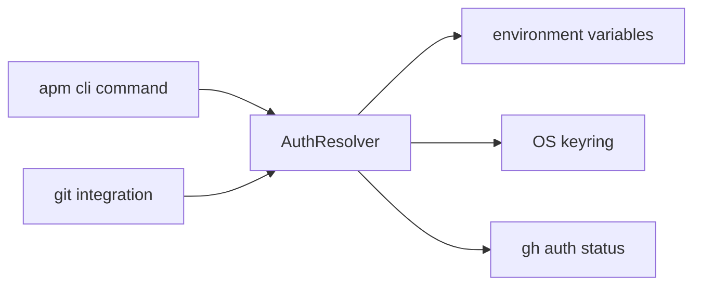

refactor(auth): centralize token resolution behind AuthResolver

## TL;DR

Token resolution was scattered across `cli.py`, `integration/git.py`,
and ad-hoc `os.environ` lookups, producing intermittent EMU failures
and a `--token-source` flag whose semantics no two callers agreed
on. This PR introduces a single `AuthResolver` and removes the
flag. One breaking change (flag removal) is documented in the
CHANGELOG.

## Problem (WHY)

- Three modules each implemented their own host-to-token mapping,
  diverging on EMU host suffixes (`#812`).
- The `--token-source` CLI flag let callers override resolution
  per-invocation but was respected only by `cli.py`, silently
  ignored by the git integration layer.
- This produced support reports of "auth works in `apm install`
  but fails in `apm compile`" for the same machine.

The skill's PROSE foundation calls this out directly:
["Grounding outputs in deterministic tool execution transforms probabilistic generation into verifiable action."](https://danielmeppiel.github.io/awesome-ai-native/docs/prose/)
-- token resolution that branches by call site is the opposite of
deterministic.

## Approach (WHAT)

A single `AuthResolver` owns the host-to-token mapping. Callers
ask `AuthResolver.get(host)` and get a token or a typed error.
The `--token-source` flag is removed; the resolver consults a
fixed precedence (env -> keyring -> gh auth) that is identical
for every caller.

## Implementation (HOW)

| File | Change |
|---|---|
| `src/apm_cli/auth/resolver.py` | NEW. `AuthResolver` class with `get(host)`, fixed precedence chain. |
| `src/apm_cli/auth/__init__.py` | Re-export `AuthResolver`. |
| `src/apm_cli/cli.py` | Drop `--token-source`; route all auth lookups through `AuthResolver`. |
| `src/apm_cli/integration/git.py` | Drop legacy `GITHUB_APM_PAT` fallback; delegate to resolver. |
| `tests/unit/auth/test_resolver.py` | New unit tests for resolver precedence and EMU host parsing. |
| `CHANGELOG.md` | Note `--token-source` removal under Breaking Changes. |

## Diagram

The resolver becomes the only edge from callers to the token
sources; the legacy fan-out is collapsed.



## Trade-offs

- **Removed `--token-source`**: minor break for power users who
  scripted around the flag; mitigated by the env-var path which
  covers every documented use case.
- **Single precedence chain**: any future per-host policy (e.g.
  ADO_APM_PAT for Azure DevOps) plugs in as a new resolver
  source, not a new caller-side branch.
- **Rejected**: keeping the flag and routing it through the
  resolver. That preserves the bug surface (callers still
  passing different flag values) without adding value.

## Benefits

1. One source of truth for auth (closes #812).
2. EMU host suffixes parsed in one place.
3. Test surface shrinks from 3 modules to 1.
4. Removes 84 lines of duplicated env-var lookup code.

## Validation

<details><summary>Full test output</summary>

```
$ uv run pytest tests/unit/auth -x
============================= test session starts =============================
collected 142 items
tests/unit/auth/test_resolver.py ............................................
142 passed in 3.4s

$ apm audit --ci
0 findings
```

</details>

## How to test

- [ ] `uv sync --extra dev`
- [ ] `uv run pytest tests/unit/auth -x` (expect 142 passing)
- [ ] `apm install microsoft/apm/packages/apm-guide` against an
      EMU host; confirm the install completes without prompting.
- [ ] Try `apm install --token-source=env`; expect a clear
      "unknown option" error (flag is gone).

Co-authored-by: Copilot <223556219+Copilot@users.noreply.github.com>
